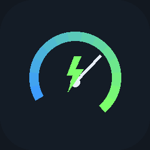
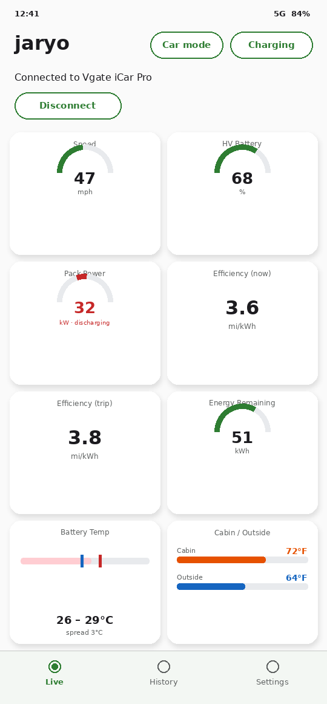
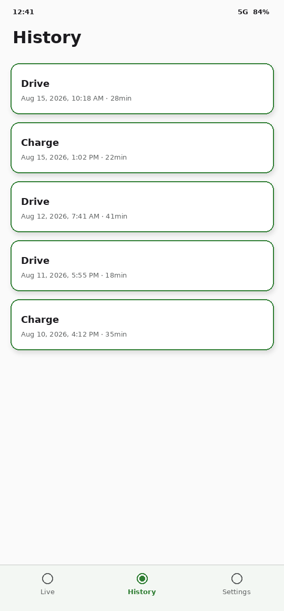
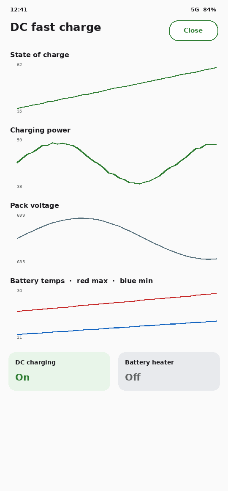
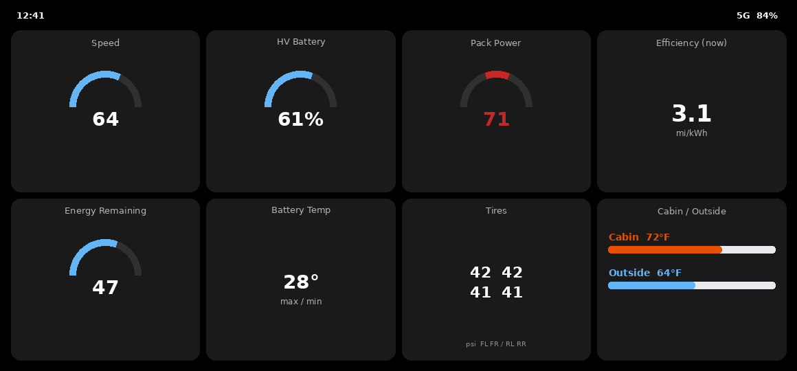

# jaryo

<p align="center">
  
</p>

<p align="center">
  <strong>Live Ioniq 5 telemetry over a Bluetooth ELM327</strong><br />
  Unofficial · not affiliated with Hyundai
</p>

<p align="center">
  <a href="https://github.com/thegliffy/garage-telemetry-android/releases/latest"></a>
  
</p>

jaryo is a phone dashboard for a Hyundai Ioniq 5 (E-GMP). Pair a classic Bluetooth
OBD2 adapter, leave it in the car, and the Live tab draws SOC, pack power, efficiency,
temps, motors, and tires while a foreground service keeps logging with the screen off.

Trips are stored on the phone first (Drive vs Charge). Optionally they upload to the
same ingest API as the garage Pi logger, so home arrivals and road trips land in one
Postgres / Grafana history.

The Ioniq 5 answers almost nothing on standard Mode 01 PIDs. Everything useful here
comes from manufacturer Mode 22 (UDS), decoded from published E-GMP offsets and
checked against frames from the car.

## Screenshots

<p align="center">
  
  
  
</p>

<p align="center">
  
</p>

| | |
| --- | --- |
| **Live** | Eight configurable tiles (2×4 portrait, 4×2 landscape). Gauges, numbers, power arcs, dual cabin/outside thermometers, tire corners, motors. |
| **Car mode** | Same tiles full-screen landscape, screen held awake, laid out so they fit without scrolling. |
| **Charging** | DC fast-charge charts: SOC, kW, pack voltage, battery max/min. |
| **History** | Each session is prefixed Drive or Charge. Summary plus charts (temps and motors overlaid). |

Plug into CCS (or pack power at DC rates) and logging splits a **Charge** record off the
current **Drive**. Unplug and the next stretch is a Drive again.

## Install

1. Pair the ELM327 in **Android Bluetooth settings** (the app lists paired devices; it
   does not scan).
2. Install the APK from [Releases](https://github.com/thegliffy/garage-telemetry-android/releases).
   Physical phone only — classic SPP does not work on an emulator.
3. **Settings** → pick the adapter. Set the API URL and key if you want sync
   (**Test connection** checks both).
4. **Live** → grant Bluetooth and notification permission → **Connect**.

Keep the APK? A drive keeps recording in a connected-device foreground service. **Car
mode** / **Charging** are buttons on the Live tab, not extra nav items.

Companion at home: [`garagepi`](https://github.com/thegliffy/garagepi) takes a snapshot
when the car is parked. Shared contract: [`garage-telemetry-api`](https://github.com/thegliffy/garage-telemetry-api).

## Tiles

Tap a tile to choose the signal and how it is drawn: number, arc, bidirectional power
arc, thermometer, battery hi/low, four-corner tires, front/rear motors, or cabin and
outside on one tile.

Speed and odometer offsets shipped calibrated. The Calibrate tab is hidden; restore
`ROUTE_CALIBRATION` in `ui/GarageNavHost.kt` if a decode ever goes wrong.

## Data and sync

Every sample is written to Room first. Sync is a WorkManager job that retries when the
ingest host is reachable, so leaving home wifi does not drop a drive. Settings shows
what is waiting and has **Sync now**.

Retention: 1 month, 1 year, until uploaded, or keep forever. Age limits delete a drive
even if it never reached the server — the screen says so.

Granularity (every poll / 1 s / 2 s / 5 s) thins what is stored and uploaded. Live
gauges still update every poll.

## Architecture

```
bluetooth/   ELM327 classic SPP, connect fallback ladder
obd/         Mode 22 decoders, poll schedule, sanitizer, efficiency
service/     foreground logging loop + process-wide UI state
data/        Room trips (drive | charge) and readings
sync/        ingest client, WorkManager upload + retention
ui/          Live tiles, car mode, DC charge, history, settings
```

Play listing notes and a privacy draft live in the repo when present
([`PLAY_STORE.md`](PLAY_STORE.md), [`PRIVACY.md`](PRIVACY.md)). Trademark notes:
[`NOTICE`](NOTICE).

## Caveats

- Ioniq 5 (E-GMP) only. Other cars will connect and show nonsense.
- Speed is stored as `SPEED_VMCU` in mph, not shared `010D` (km/h), so it does not
  collide with garagepi.
- Power / regen limits have read 277 kW parked — treat as unverified.
- Energy remaining reads low versus a 77.4 kWh pack; compare against the dash.
- Release APKs on GitHub are debug-signed. That signature proves nothing about origin.
  A Play upload needs its own signing key.

## License

[MIT](LICENSE). Hyundai, Ioniq, and IONIQ 5 are trademarks of their owners.
